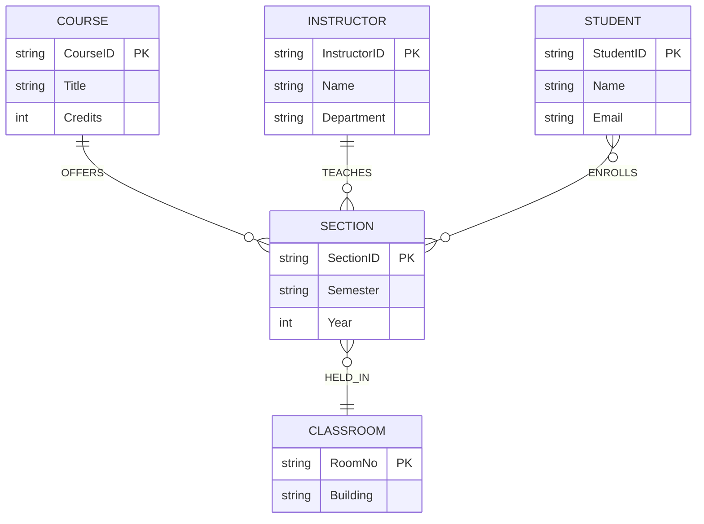

# Question 1 — University Course Registration

## Original (Flawed) Model

**Entities**
- `Student` (StudentID, Name, Email)
- `Course` (CourseID, Title, Credits, Semester, Year)
- `Instructor` (InstructorID, Name, Department)
- `Classroom` (RoomNo, Building)

**Relationships**
- `ENROLLS` : Student — Course
- `TEACHES` : Instructor — Course
- `HELD_IN` : Course — Classroom

## Business Rules

1. The same course is offered in many semesters and years.
2. A course may have multiple sections in the same semester.
3. Different sections may be taught by different instructors.
4. A student registers for a particular section, not merely for a course.
5. Classroom allocation may differ across sections.

## The Core Problem

The diagram has **no concept of a "Section"** (an offering of a course in one semester/year, possibly one of several run in parallel). Everything — semester/year, instructor, classroom, and student registration — is wired directly to the catalog-level `Course` entity. This single missing entity is the root cause of all four flaws below.

## The 4 Issues

### Issue 1 — `Semester`/`Year` are attributes of `Course`, not of an offering
**Flaw:** `Semester` and `Year` are modeled as simple attributes of `Course`, the same entity that holds the permanent catalog data (`Title`, `Credits`). But rule 1 says one course (e.g. CS101) recurs across *many* semesters/years.
**Information lost:** A simple attribute holds one value. If `CourseID` is the key, `Semester`/`Year` can only ever record a single offering — every other semester/year that course has ever run in is unrepresentable (or forces duplicate `Course` rows with repeated `Title`/`Credits`, an update anomaly). The link between "the same course" across terms is lost entirely.

### Issue 2 — `TEACHES` connects `Instructor` to `Course`, not to a section
**Flaw:** Rule 3 says different sections (of the same course, same semester) may be taught by different instructors, but `TEACHES` is drawn from `Instructor` straight to `Course`.
**Information lost:** With the relationship anchored at the course level, you can tell *which instructors are associated with the course* but not *which instructor teaches which section*. Two sections with two different instructors collapse into an undifferentiated set.

### Issue 3 — `ENROLLS` connects `Student` to `Course`, not to a section
**Flaw:** Rule 4 explicitly states a student registers for a *section*, not the course in the abstract. `ENROLLS` is drawn `Student — Course`.
**Information lost:** Once a course has multiple sections, there is no way to know which section (and by extension, which instructor, schedule, and classroom) a given student actually enrolled in.

### Issue 4 — `HELD_IN` connects `Course` to `Classroom`, not a section to a classroom
**Flaw:** Rule 5 says classroom allocation may differ across sections, but `HELD_IN` is drawn `Course — Classroom`.
**Information lost:** A room tied to the whole course cannot capture that Section A meets in Room 101 while Section B (same course, same term) meets in Room 204.

## Minimal Correction

Introduce a new **`Section`** entity between `Course` and everything else. Only the part of the model touching sections changes — `Student`, `Instructor`, `Classroom`, and `Course`'s catalog attributes stay as they are.

**What changed:**
- `Semester` and `Year` moved from `Course` to the new `Section` entity.
- `TEACHES` now attaches `Instructor` to `Section` (an instructor may teach many sections; each section has one instructor).
- `ENROLLS` now attaches `Student` to `Section` (many-to-many — a student takes many sections, a section has many students).
- `HELD_IN` now attaches `Section` to `Classroom`.
- `Course` keeps only its catalog-level, term-independent attributes (`Title`, `Credits`), linked to its `Section`s via a new `OFFERS` relationship (1 course : many sections).
