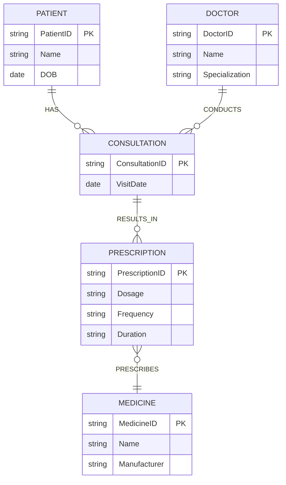

# Question 2 — Hospital Prescription System

## Original (Flawed) Model

**Entities**
- `Patient` (PatientID, Name, DOB)
- `Doctor` (DoctorID, Name, Specialization)
- `Medicine` (MedicineID, Name, Manufacturer, Dosage)

**Relationships**
- `CONSULTS` : Patient — Doctor
- `PRESCRIBES` : Doctor — Medicine
- `TAKES` : Patient — Medicine

## Business Rules

1. A patient may consult the same doctor many times.
2. Different consultations may result in different prescriptions.
3. The dosage of the same medicine may differ by patient and visit.
4. The same medicine may be prescribed again with a different frequency or duration.
5. A prescription must identify **who prescribed what, to whom, and when**.

**Must be preserved:** repeated consultations, prescription history, patient-specific dosage, time-dependent instructions.

## The 4 Issues

### Issue 1 — `CONSULTS` cannot represent repeated visits
**Flaw:** `CONSULTS` is a plain relationship between `Patient` and `Doctor`. A plain relationship yields at most one edge per entity pair — it has no visit date/identity of its own.
**Information lost:** Rule 1 requires that the same patient can consult the same doctor many times. As drawn, a second consultation between the same pair has nothing to attach to and is indistinguishable from the first — visit history (dates, number of visits) is lost.

### Issue 2 — `PRESCRIBES` is anchored at Doctor–Medicine, disconnected from patient/visit
**Flaw:** `PRESCRIBES` connects `Doctor` directly to `Medicine`, with no reference to which patient or which consultation the prescription belongs to.
**Information lost:** Rule 5 requires a prescription to identify who prescribed what, **to whom, and when**. As modeled, a prescription only records "this doctor generally prescribes this medicine" — the patient, the visit, and the date are all unrecoverable. It also can't satisfy rule 2 (different consultations → different prescriptions), since prescriptions aren't tied to a consultation at all.

### Issue 3 — `Dosage` is a fixed attribute of `Medicine`
**Flaw:** `Dosage` is stored on `Medicine` (MedicineID, Name, Manufacturer, **Dosage**) as if it were a catalog property of the drug.
**Information lost / misrepresented:** Rule 3 says dosage varies by patient *and* by visit — it is not a property of the medicine itself. Storing it on `Medicine` forces one dosage value to apply to every patient and every prescription of that medicine, which is factually wrong and destroys patient-specific dosing information.

### Issue 4 — `TAKES` duplicates and conflicts with the prescribing path, and can't hold repeat prescriptions
**Flaw:** `TAKES` is a second, independent relationship straight from `Patient` to `Medicine`, parallel to (and disconnected from) `PRESCRIBES`.
**Information lost:** As a plain relationship it collapses to one edge per patient–medicine pair, so rule 4 (same medicine prescribed again with a different frequency/duration) cannot be represented — the second prescription has nowhere to attach its own frequency/duration. It's also structurally redundant: "what a patient takes" should be *derived* from doctor → consultation → prescription → medicine, not asserted separately with no link to the doctor, visit, or date that authorized it.

## Minimal Correction

Introduce **`Consultation`** (one record per visit) and **`Prescription`** (one record per medicine issued during a visit) as associative entities. `Patient`, `Doctor`, and `Medicine`'s non-dosage attributes are untouched.

**What changed:**
- `CONSULTS` replaced by a `Consultation` entity (own ID + `VisitDate`), linked to both `Patient` and `Doctor` — every visit is now a distinct, dated record, so repeat consultations are naturally supported.
- `PRESCRIBES` and `TAKES` are both removed and replaced by a `Prescription` entity hanging off `Consultation`, carrying `Dosage`, `Frequency`, and `Duration`. This satisfies "who (Doctor, via Consultation) prescribed what (Medicine), to whom (Patient, via Consultation), and when (VisitDate)."
- `Dosage` removed from `Medicine` and moved to `Prescription`, since it is a property of a specific prescribing event, not of the drug.
- A patient's medication history is now derived via `Patient → Consultation → Prescription → Medicine`, so repeated prescriptions of the same medicine with different frequency/duration are simply separate `Prescription` rows.
