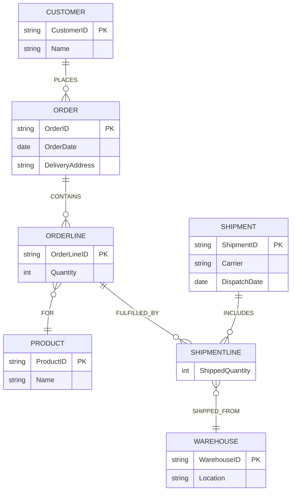

# Question 3 — E-Commerce Order Fulfilment

## Original (Flawed) Model

**Part A — Entities**
- `Customer` (CustomerID, Name, ShippingAddress)
- `Order` (OrderID, OrderDate, ShipmentDate)
- `Product` (ProductID, Name, ...)

**Part A — Relationships**
- `PLACES` : Customer — Order
- `CONTAINS` : Order — Product

**Part B — Entities**
- `Shipment` (ShipmentID, Carrier)
- `Warehouse`

**Part B — Relationships**
- `SHIPPED_BY` : Order — Shipment
- `FROM` : Shipment — Warehouse

(Parts A and B together form one flawed ER model.)

## Business Rules

1. A customer may use a different delivery address for every order.
2. Quantity is specific to an order line, not to the product itself.
3. One order may be split into several shipments.
4. A single order line may be partially shipped from different warehouses.
5. Each shipment has its own dispatch date and carrier information.

**Corrected model must support:** historical order data, line-item quantity, split shipments, partial fulfilment.

## The 4 Issues

### Issue 1 — `ShippingAddress` is a fixed attribute of `Customer`
**Flaw:** `ShippingAddress` sits on `Customer`, implying one address per customer, permanently.
**Information lost:** Rule 1 says the delivery address can differ *per order*. If it lives on `Customer`, updating it for a new order overwrites the address on record for every past order too — the historical delivery address of prior orders is destroyed, and there's no way to have two different addresses active for two different orders.

### Issue 2 — `CONTAINS` has nowhere to store `Quantity`
**Flaw:** `CONTAINS` is a plain (unattributed) relationship diamond between `Order` and `Product`.
**Information lost:** Rule 2 explicitly says quantity belongs to the order line (the order–product pairing), not to the product. A plain relationship with no attributes cannot record how many units of a product were ordered — that number is simply unrepresentable in the current diagram.

### Issue 3 — `ShipmentDate` is a fixed attribute of `Order`
**Flaw:** `Order` carries a single `ShipmentDate` attribute, implying the whole order ships on one date.
**Information lost:** Rule 3 says one order may be split into several shipments, and rule 5 says each shipment has its *own* dispatch date. A single `ShipmentDate` on `Order` can hold only one value — the dispatch dates of the other shipments in a split order are lost (and it duplicates/conflicts with the dispatch date that correctly belongs on `Shipment` in Part B).

### Issue 4 — `SHIPPED_BY` connects `Order` (as a whole) to `Shipment`
**Flaw:** `SHIPPED_BY` is drawn `Order — Shipment`, treating the order as an indivisible unit being shipped.
**Information lost:** Rule 4 says a single order *line* may be partially shipped from different warehouses. If shipments attach to the whole order, there is no way to record which product, which line, or how many of the ordered units went into which shipment — the line-level, partial-fulfilment relationship between order lines and shipments is entirely missing.

## Minimal Correction

Introduce **`OrderLine`** (replacing the unattributed `CONTAINS`) and **`ShipmentLine`** (replacing the order-level `SHIPPED_BY`) as associative entities, and relocate two misplaced attributes. `Product`, `Shipment`'s existing attributes, and `Warehouse` are untouched.

**What changed:**
- `ShippingAddress` moved from `Customer` to `Order` (renamed `DeliveryAddress`) — each order snapshots the address it was actually delivered to, preserving history.
- `CONTAINS` replaced by an `OrderLine` associative entity carrying `Quantity`, linked to both `Order` and `Product`.
- `ShipmentDate` removed from `Order`; dispatch timing correctly stays only on `Shipment` (as `DispatchDate`), consistent with rule 5.
- `SHIPPED_BY` replaced by a `ShipmentLine` associative entity that connects a specific `OrderLine` to a specific `Shipment` and `Warehouse`, carrying `ShippedQuantity`. This lets one order line be split across multiple shipments/warehouses (partial fulfilment) and one shipment cover multiple order lines (split shipments), satisfying rules 3 and 4.
