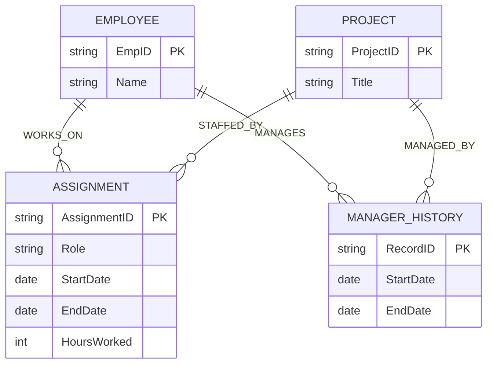

# Question 4 — Project Staffing and Roles

## Original (Flawed) Model

**Entities**
- `Employee` (EmpID, Name, Role)
- `Project` (ProjectID, Title, HoursWorked)
- `Department` (DeptID, Name)

**Relationships**
- `WORKS_ON` : Employee — Project
- `BELONGS_TO` : Employee — Department
- `MANAGED_BY` : Employee — Project

## Business Rules

1. An employee may join, leave, and later rejoin the same project.
2. The employee's role may be different on different projects.
3. Hours are recorded per employee-project assignment and time period.
4. Project managers may change during the lifetime of a project.
5. Management history must be retained for audit purposes.

**Focus:** information that is assignment-specific, time-dependent, or historical.

## The 4 Issues

### Issue 1 — `Role` is a fixed attribute of `Employee`
**Flaw:** `Role` sits on `Employee` as a single, global value.
**Information lost:** Rule 2 says role may differ per project (e.g. "Developer" on Project A, "Tech Lead" on Project B). A single attribute on `Employee` can only hold one role at a time, applied to every project the employee is on — per-project role is unrepresentable.

### Issue 2 — `HoursWorked` is a fixed attribute of `Project`
**Flaw:** `HoursWorked` sits on `Project` as a single aggregate value.
**Information lost:** Rule 3 says hours are recorded per employee–project assignment *and* per time period, not as one project-wide total. As modeled there is no way to tell which employee logged how many hours, or during which period — only a single (and effectively unmaintainable, constantly-overwritten) number for the whole project.

### Issue 3 — `WORKS_ON` cannot represent join/leave/rejoin history
**Flaw:** `WORKS_ON` is a plain relationship between `Employee` and `Project`, with no attributes of its own.
**Information lost:** A plain relationship yields at most one edge per entity pair. Rule 1 requires an employee to be able to join, leave, and later rejoin the *same* project — each stint needs its own start/end period. As drawn, a second stint on the same project has nothing to attach to and collapses into (or is indistinguishable from) the first; the join/leave history is lost.

### Issue 4 — `MANAGED_BY` cannot retain management history
**Flaw:** `MANAGED_BY` is a plain relationship between `Employee` and `Project`, capturing only "who manages this project right now."
**Information lost:** Rule 4 says managers may change over a project's lifetime, and rule 5 explicitly requires that management history be retained for audit. A plain relationship has no way to hold more than the current manager — when the manager changes, the previous manager's tenure (who they were, and for what period) is simply overwritten and lost, directly violating the audit requirement.

## Minimal Correction

Turn `WORKS_ON` into an **`Assignment`** associative entity and `MANAGED_BY` into a **`ManagerHistory`** associative entity, and relocate the two misplaced attributes. `Department` and `BELONGS_TO` are unaffected and not redrawn.

**What changed:**
- `Role` removed from `Employee`; moved into `Assignment`, since role is a property of one employee's participation in one project.
- `HoursWorked` removed from `Project`; moved into `Assignment` alongside `StartDate`/`EndDate`, so hours are tracked per employee, per project, per time period.
- `WORKS_ON` replaced by an `Assignment` entity with its own `StartDate`/`EndDate` per stint — an employee can have multiple `Assignment` rows against the same project, capturing join/leave/rejoin history.
- `MANAGED_BY` replaced by a `ManagerHistory` entity with `StartDate`/`EndDate` — each manager's tenure on a project is a separate, permanent record instead of a single overwritable edge, satisfying the audit requirement.
