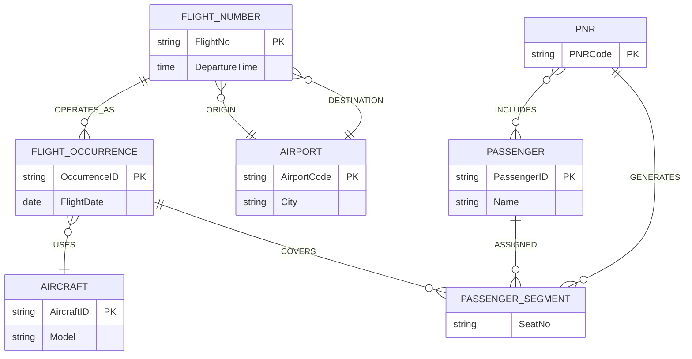

# Question 5 — Airline Booking and Seat Assignment

## Original (Flawed) Model

**Part A — Entities**
- `Passenger` (PassengerID, Name)
- `Flight` (FlightNo, Date, DepartureTime)
- `Aircraft` (AircraftID, Model)

**Part A — Relationships**
- `BOOKS` : Passenger — Flight
- `USES` : Flight — Aircraft
- `SEATED_ON` : a ternary relationship among Passenger, Flight, and Aircraft

**Part B — Entities**
- `Airport` (AirportCode, City)

**Part B — Relationships**
- `ORIGIN` : Flight — Airport
- `DESTINATION` : Flight — Airport

(Parts A and B together form one flawed ER model.)

## Business Rules

1. A flight number operates on many dates.
2. One PNR may contain several passengers and several flight segments.
3. Aircraft assignment may change for one particular flight occurrence.
4. A seat is assigned to a passenger for a specific flight occurrence.
5. The same passenger may have different seats on different segments.

**Corrected model must represent:** PNR/bookings, flight occurrences, aircraft changes, segment-specific seats.

## The 4 Issues

### Issue 1 — `Flight` conflates the flight number with a specific flight occurrence
**Flaw:** `Flight` carries `Date` as a simple attribute alongside `FlightNo`, treating "flight number" and "the specific dated departure" as the same entity.
**Information lost:** Rule 1 says one flight number (e.g. AA100) operates on many dates. If `Date` is a plain attribute keyed under `FlightNo`, only one date can be recorded per flight-number record — there is no way to represent that AA100 runs daily while sharing the same route/schedule. Everything downstream that should attach to *one specific day's departure* (aircraft, seats) has nowhere correct to attach either.

### Issue 2 — `BOOKS` has no concept of a PNR (reservation)
**Flaw:** `BOOKS` is a plain relationship directly from `Passenger` to `Flight`.
**Information lost:** Rule 2 says one PNR may group several passengers *and* several flight segments as a single reservation. A direct Passenger–Flight edge cannot express that grouping — there's no way to retrieve "everyone and everything booked under PNR XYZ123" as a unit; each booking is an isolated, disconnected fact.

### Issue 3 — `USES` cannot represent aircraft reassignment per occurrence
**Flaw:** `USES` connects `Aircraft` to `Flight` — and since `Flight` conflates flight-number and occurrence (Issue 1), this effectively ties one aircraft to the flight number as a whole, not to one specific day's flight.
**Information lost:** Rule 3 says aircraft assignment may change for *one particular* occurrence (e.g. AA100 on 12 Aug swaps planes) without affecting other dates of the same flight number. As modeled, there's no per-occurrence anchor point for `USES`, so occurrence-specific aircraft changes can't be recorded.

### Issue 4 — `SEATED_ON` is a ternary relationship, and isn't anchored to a segment
**Flaw:** `SEATED_ON` links `Passenger`, `Flight`, and `Aircraft` together in one three-way relationship.
**Information lost:** Rule 4 says a seat belongs to a passenger for a specific *flight occurrence* — aircraft shouldn't be a co-equal participant in seating (it's already implied via the occurrence's `USES` link, so including it here is redundant and ambiguous). More importantly, a ternary relationship at the flight-number level (again, because `Flight` isn't split into number/occurrence) can't cleanly give rule 5's requirement — that the same passenger has *different* seats on *different segments* — since there's no segment-level anchor for the seat number to attach to.

## Minimal Correction

Split `Flight` into **`FlightNumber`** (schedule-level) and **`FlightOccurrence`** (one specific dated departure), and introduce **`PNR`** and **`PassengerSegment`** (replacing the ternary `SEATED_ON`). `Passenger`'s and `Aircraft`'s own attributes, and the `Airport` entity, are untouched — `ORIGIN`/`DESTINATION` correctly stay at the `FlightNumber` level since the route doesn't change per date.

**What changed:**
- `Flight` split into `FlightNumber` (FlightNo, DepartureTime — the recurring schedule) and `FlightOccurrence` (OccurrenceID, FlightDate — one specific day's departure), linked 1-to-many via `OPERATES_AS`.
- `USES` now connects `FlightOccurrence` to `Aircraft`, so aircraft can be (re)assigned per specific dated flight without touching other occurrences of the same flight number.
- `BOOKS` replaced by a `PNR` entity: `PNR` — `Passenger` (many-to-many, several passengers per PNR) and `PNR` — `PassengerSegment` (several segments per PNR).
- Ternary `SEATED_ON` replaced by a binary associative entity `PassengerSegment`, carrying `SeatNo`, linking one `Passenger` to one `FlightOccurrence` within one `PNR`. Since each segment gets its own `PassengerSegment` row, the same passenger can hold different seats on different segments (rule 5), and each seat is tied to a specific occurrence (rule 4).
- `ORIGIN`/`DESTINATION` remain attached to `FlightNumber` (unchanged) since the route is schedule-level, not date-level, information.
